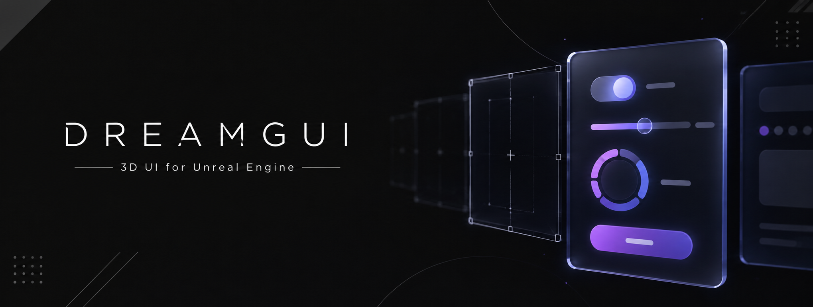

<p align="center">
  
</p>

<table>
  <tr>
    <td width="64%" valign="top">
      <h1>DreamGUI</h1>
      <p><strong>Unreal Engine 5.8 的 3D UI 系统。</strong></p>
      <p>
        控件是一个带矩形、锚点和轴心的 <code>UObject</code>，排成一棵树，由 Canvas 尽量合批成最少的 draw call
        ——可以铺在屏幕上，也可以以任意角度立在关卡里，两种情况下点击检测都准确。一棵界面树就是一个可以继承的
        Widget Blueprint，用 <code>.dui</code> 文本或 UMG 风格的设计器编写，两边改的是同一个类。自带控件库、补间动画、
        按玩家区分的输入和手柄导航。
      </p>
      <p>
        
        
        
        
      </p>
      <p>
        <a href="README.md">English</a> &nbsp;·&nbsp;
        <a href="https://gui.toolchain.64hz.cn/docs">文档站</a> &nbsp;·&nbsp;
        <a href="https://gui.toolchain.64hz.cn/docs/start/installation">快速上手</a> &nbsp;·&nbsp;
        <a href="https://gui.toolchain.64hz.cn/docs/dui/overview">.dui 语言</a> &nbsp;·&nbsp;
        <a href="https://gui.toolchain.64hz.cn/docs/reference">类参考</a> &nbsp;·&nbsp;
        <a href="CHANGELOG.md">更新日志</a>
      </p>
      <p>
        <a href="https://github.com/TypeDreamMoon/DreamGUI/issues">
          
        </a>
        <a href="https://github.com/TypeDreamMoon/dreamui-language-support">
          
        </a>
        <a href="https://github.com/TypeDreamMoon/DreamShader">
          
        </a>
        <a href="https://github.com/TypeDreamMoon/DreamFX">
          
        </a>
      </p>
    </td>
    <td width="36%" align="center" valign="middle">
      
    </td>
  </tr>
</table>

> [!TIP]
> 每个 `.dui` 文件都放进版本控制，和它作为源文件的那个 Widget Blueprint 放在一起。Blueprint 的层级是从文件编译出来的，
> 在设计器里改的属性也会写回文件，所以评审、diff、合并看的都是这份文本。

> [!NOTE]
> **1.0.0 是第一个公开版本。** 在它之前，这个 fork 的开发版依次编号为 1.x、2.0.0、2.1.0（`main` 上的提交 `2416e3f8`、`3049561a`）；
> 用着其中某个版本的项目请看 [Docs/Migration.md](Docs/Migration.md#from-21-to-100)——1.0.0 不再带 CoreRedirects，
> 这些版本（以及 LGUI、LexUI）保存的资产，要在用它打开之前重存一次。DreamGUI fork 自 Lex Liu 的
> [LGUI / LexUI](https://github.com/liufei2008/LGUI)，MIT 许可——但不是它的直接替代品。

---

## 长什么样

```text
class /Game/UI/WBP_Settings
use "UI/Library.dui" as ui

VerticalBox Root : ui.Page {
    Spacing = 24

    Text Title : ui.Heading { Text = "Settings" }

    rows ui.Row : ui.Wide (Label, Value) {
        "Subtitles",  "On"
        "Difficulty", "Normal"
        "Vibration",  "Off"
    }

    Native.Button Apply {
        Text { Text = "Apply" }
        OnClicked -> HandleApply
    }

    Text Hint : ui.Note {
        Shown <- bDirty
        Text  = "Unsaved changes"
    }
}
```

一个库提供样式和 `Row` 组件，`rows` 一行一个实例，按钮的点击路由到用户控件上的函数，提示文字在变量为真时显示。
编译之后它就是一个普通的 Widget Blueprint——一个 `UDreamWidgetBlueprint`，生成的类是 `UDreamUserWidget`：

```cpp
UDreamUIBPLibrary::AddWidgetOfClassToViewport(this, WBP_Settings);   // 屏幕上的一层
```

或者拖进关卡，就是一个 `ADreamWorldWidgetActor`——同一个类，成了世界里的一块面板。

## 快速上手

1. 克隆到项目的 `Plugins/` 目录，重新生成工程文件并编译：

   ```bash
   git clone https://github.com/TypeDreamMoon/DreamGUI.git Plugins/DreamGUI
   ```

   对一个新项目，这就是全部安装步骤，Launcher 安装版引擎也一样：插件只编译引擎的公开头文件，并在 `ThirdParty/`
   下自带一份生成好的 msdfgen。
2. 打开 [`Content/Samples/HelloDreamGUI.dui`](Content/Samples/HelloDreamGUI.dui)——仍然算一个真界面的最小文件。给它新建一个
   Widget Blueprint（*内容浏览器 ▸ 添加 ▸ DreamGUI Widget*），父类选 **DreamUI Text User Widget**
   （`UDreamTextUserWidget`）——只有这种类的设计器工具栏里才有 *Set Source File…*——用它指向这个文件，编译。
3. 显示它：在蓝图图表里用 **Create Dream Widget** 接 **Add to Viewport**，和 UMG 一样——文件的 `props` 就是创建节点上的
   引脚；在 C++ 里用 `UDreamUIBPLibrary::AddWidgetOfClassToViewport`。或者把 Blueprint 拖进关卡。屏幕根、射线检测器和
   事件系统都会按需创建，不需要别的配置。

有两项设置值得早点做：为非美式键盘布局接管游戏视口客户端，以及为引擎的纯 UI 输入模式打开 Slate 输入源。两者都在
[安装](https://gui.toolchain.64hz.cn/docs/start/installation)里。

## 里面有什么

| | |
| :-- | :-- |
| **控件与画布** | 带锚点和轴心的矩形；负责绘制的 visual（文字、图片、矩形块、多边形、圆环、线条）；画布只遍历变化了的控件，并原地修补变化的分段 |
| **屏幕与世界** | 屏幕空间；任意角度的世界空间（用 DreamGUI 自己的渲染器，或走引擎管线吃后处理和深度）；贴到任意网格上的 RenderTarget；逐控件透视；三维的渲染变换 |
| **Widget Blueprint** | 一棵树就是一个类：可以继承、嵌套、填它的具名插槽、按名字拿到子节点；设计器直接编辑这个类，对照 UMG 的设计器重做 |
| **`.dui`** | 节点、样式、资源、`use … as` 库、用 `.dui` 写的组件（`props`、`events`、插槽）、绑定和路由、`if` / `for` / `each`、`rows` 表、时间轴——每个错误都是一个带行列号的 `DUInnnn` 码 |
| **布局** | UMG 形状的面板，跑在按 Blink 和 Yoga 思路重建的布局引擎上：测量是 const 的、片段不可变、失效带原因 |
| **文字** | 距离场字形，任意缩放和角度都锐利；小字和 Slate 一样清晰；彩色 emoji、回退字体、Best Fit、渐变字、按文化断行 |
| **控件库** | 按钮、开关、滑条、数值框、输入框、下拉框、列表 / 平铺 / 树视图、对话框、标签页、环形菜单……命名和 UMG 一致，配样式结构体和样式表 |
| **输入** | 每个玩家独立的指针、焦点和文字输入目标；Tab 与手柄导航；模态、弹出层、提示、拖放；可选的 Slate 输入源 |
| **动画** | 补间；给面板里控件用的渲染变换补间；Sequencer 编辑的控件动画；`.dui` 时间轴 |

## 和 UMG 的区别

差别在结构上而不是外观上，所以选型之前值得先知道。

| | UMG / Slate | DreamGUI |
| :-- | :-- | :-- |
| 控件 | `SWidget`，保留模式的 Slate | 组件式树里的 `UObject` |
| 尺寸 | 由内容决定：控件的尺寸**就是**它的期望尺寸 | 先有框：你写一个矩形，内容排在里面 |
| 文字 | 框随文字长大 | 文字在框里对齐，可能溢出 |
| 摆放 | 相对插槽 | 锚点 + 轴心，与分辨率无关 |
| 放进世界 | `WidgetComponent`，渲染成一张面片 | 一等公民的渲染模式 |

词汇则刻意保持一致：控件用的就是它在 UMG 里的对应者的名字。`Resources/UMGParity` 为 58 个 UMG 类、约 960 个成员逐条记下
是沿用、映射还是拒绝、以及原因，并由自动化测试对着 UMG 自己的反射核对。

## 文档

完整手册发布在 **<https://gui.toolchain.64hz.cn>**，中英双语。

| | |
| :-- | :-- |
| **[快速上手](https://gui.toolchain.64hz.cn/docs/start/installation)** | 安装、第一个界面、项目结构、编写流程 |
| **[核心概念](https://gui.toolchain.64hz.cn/docs/concepts/widgets)** | 控件、画布、世界空间、Widget Blueprint、布局、文字、渲染、输入、动画 |
| **[.dui 语言](https://gui.toolchain.64hz.cn/docs/dui/overview)** | 语言的每一个构造，一页一个主题——仓库里也有一份 [Docs/DuiLanguage.md](Docs/DuiLanguage.md) |
| **[控件库](https://gui.toolchain.64hz.cn/docs/controls)** | 控件库、样式与样式表、与 UMG 的命名对照 |
| **[类参考](https://gui.toolchain.64hz.cn/docs/reference)** | 每个公开类，从反射生成——仓库里是 [Docs/Reference](Docs/Reference/index.md) |
| **[诊断码](https://gui.toolchain.64hz.cn/docs/diagnostics)** | 每一个 `DUInnnn`：它说的是什么、怎么会出现、怎么改 |
| **[指南](https://gui.toolchain.64hz.cn/docs/guides/fonts-and-packaging)** | 字体与打包、从 LGUI / LexUI 迁移、升级、平台——[Docs/Migration.md](Docs/Migration.md)、[Docs/FontsAndPackaging.md](Docs/FontsAndPackaging.md) |
| **[更新日志](CHANGELOG.md)** | 每个版本改了什么 |

## 编辑器与工具

| | |
| :-- | :-- |
| **设计器** | 按矩形拾取、悬停反馈、分轴缩放手柄、旋转手柄（按住 Shift 以 15° 为步）、锚点徽章、框选、拖拽改父节点、从内容浏览器拖入、面板收藏与搜索、撤销；*Events* 区一键生成处理函数和它的路由。对以 `.dui` 为源文件的类，属性改动写回文件里对应的那一行，结构性改动会说明原因后拒绝——层级归文件管 |
| **[VS Code 扩展](https://github.com/TypeDreamMoon/dreamui-language-support)** | `.dui` 的高亮、补全、悬停、跳转、诊断与格式化，诊断码和插件编译器一致 |
| **`DreamUI.Capture`** | 把视口和每个 RenderTarget 画布存成 PNG（蓝图里是 `UDreamUICaptureLibrary`） |
| **`DreamUI.Stats`** | 自上次调用以来每帧逐阶段的开销，以及合批数、顶点数和字节数；每个阶段在 Unreal Insights 里都是一个 `DreamUI_*` 作用域 |
| **`DreamGUI.Memory`** | 字体、图集和画布各占了多少 |
| **自动化测试** | `Automation RunTests DreamGUI`，或用 `Tools/Tests/Invoke-DreamGUITests.ps1` 按预设跑；另有模块分层和引擎私有头文件的静态检查 |
| **[`Tools/Bench`](Tools/Bench/README.md)** | 性能工作用来测量的基准：5000 个转动按钮的界面，和 2688 块世界空间面板的关卡 |

## 模块

```text
L4   DreamGUISamples
L3   DreamGUIControls      DreamGUIExtensions
L2   DreamGUIInput
L1   DreamGUI (core)
L0   DreamGUIRenderer      DreamTween
     ------------------------------------------------------------
     DreamGUIEditor, DreamGUIK2Nodes (uncooked only), DreamGUITests (editor only)
```

一个模块只依赖比它低的层里的模块，反方向的 include 会被静态检查拦下。C++ 用到核心以外某个模块里的类型时，把那个模块加进
`Build.cs`。

插件不再自带 CoreRedirects。对着 LGUI、LexUI 或 1.0.0 之前的版本保存的资产，要借 2.1.0 的重定向表（临时放进项目配置）重存一次
——三个步骤见 [Docs/Migration.md](Docs/Migration.md#from-21-to-100)。

## 平台

Unreal Engine **5.8**，源码引擎和 Launcher 安装版都行。"声称支持"和"真正跑过"是两张不同的单子，所以两张都列在这里：

| | 编译过 | 运行过 |
| :-- | :-- | :-- |
| **Win64** | 编辑器；Development 和 Shipping 的游戏目标 | 编辑器跑完整个自动化测试；发布门槛跑过打包文字冒烟测试之后的打包 Development 游戏 |
| Mac、Linux | 从未 | 从未——这里没有对应的机器和工具链 |
| iOS、Android | 从未 | 从未——这里没有 SDK，也从没上过真机 |
| 主机平台 | 否 | 不在任何模块的 `PlatformAllowList` 里 |
| 专用服务器 | 从未——没有编译过服务器目标 | 否 |

描述文件的 `SupportedTargetPlatforms` 列的是代码按哪五个平台写的，说明的是构建工具会去尝试什么，而不是有人在那里跑过。
发布门槛、从未运行过的移动端代码路径、专用服务器检查过什么，见[平台](https://gui.toolchain.64hz.cn/docs/guides/platforms)。

## 项目信息

| | |
| :-- | :-- |
| 版本 | `1.0.0` |
| Unreal Engine | `5.8` |
| 模块 | `DreamGUIRenderer`、`DreamTween`、`DreamGUI`、`DreamGUIInput`、`DreamGUIControls`、`DreamGUIExtensions`、`DreamGUISamples`（Runtime），`DreamGUIEditor`、`DreamGUIK2Nodes`（uncooked），`DreamGUITests`（Editor） |
| 作者 | TypeDreamMoon |
| GitHub | <https://github.com/TypeDreamMoon> |
| 文档 | <https://gui.toolchain.64hz.cn/> |
| 上游 | Lex Liu 的 [LGUI / LexUI](https://github.com/liufei2008/LGUI) |
| 许可证 | [MIT](LICENSE) |

## 许可证

MIT——见 [LICENSE](./LICENSE)。

Copyright (c) 2026-present TypeDreamMoon
Copyright (c) 2019-present Lex Liu

本软件的大部分内容仍是 Lex Liu 的作品，按[原项目](https://github.com/liufei2008/LGUI)的 MIT 条款使用。任何副本或主要部分
（包括你的）都必须附带这份 MIT 声明。

问题反馈和功能建议请提 [issue](https://github.com/TypeDreamMoon/DreamGUI/issues/new)。

## Star History

<a href="https://www.star-history.com/?repos=typedreammoon%2Fdreamgui&type=date&legend=bottom-right">
 <picture>
   <source media="(prefers-color-scheme: dark)" srcset="https://api.star-history.com/chart?repos=typedreammoon/dreamgui&type=date&theme=dark&legend=bottom-right" />
   <source media="(prefers-color-scheme: light)" srcset="https://api.star-history.com/chart?repos=typedreammoon/dreamgui&type=date&legend=bottom-right" />
   
 </picture>
</a>
